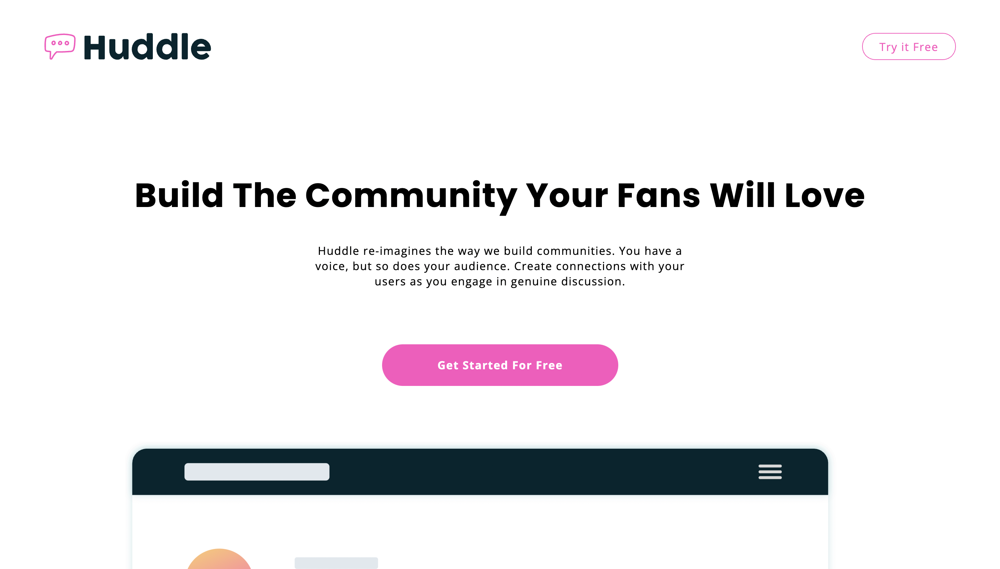
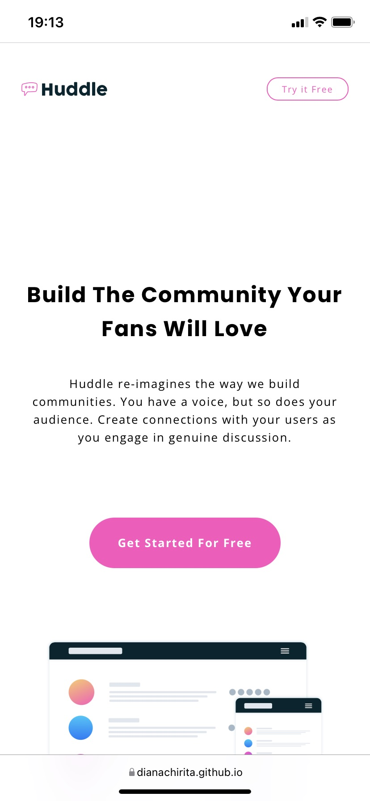

# Frontend Mentor - Huddle landing page with curved sections solution

This is a solution to the [Huddle landing page with curved sections challenge on Frontend Mentor](https://www.frontendmentor.io/challenges/huddle-landing-page-with-curved-sections-5ca5ecd01e82137ec91a50f2). Frontend Mentor challenges help you improve your coding skills by building realistic projects.

## Table of contents

- [Overview](#overview)
  - [The challenge](#the-challenge)
  - [Screenshot](#screenshot)
  - [Links](#links)
- [My process](#my-process)
  - [Built with](#built-with)
  - [What I learned](#what-i-learned)
- [Author](#author)

## Overview

### The challenge

Users should be able to:

- View the optimal layout for the site depending on their device's screen size
- See hover states for all interactive elements on the page

### Screenshot




### Links

- Live Site URL: [Live site URL here](https://dianachirita.github.io/Landing-page/)

## My process

### Built with

- Semantic HTML5 markup
- CSS custom properties
- Flexbox
- CSS Grid

### What I learned

This was a nice challenge. I practiced my CSS skills and I tried to have a good code organization. I learned how to work with CSV files. I learned about some HTML5 tags, such as main, footer and picture (when working with different images based on the screen size).

```html
<picture>
  <source
    media="(min-width: 601px)"
    srcset="./images/bg-footer-top-desktop.svg"
  />
  <source
    media="(max-width: 600px)"
    srcset="./images/bg-footer-top-mobile.svg"
  />
  
</picture>
```

## Author

- Frontend Mentor - [@DianaChirita](https://www.frontendmentor.io/profile/DianaChirita)
- Twitter - [@dianaa_elena](https://twitter.com/dianaa_elena)
